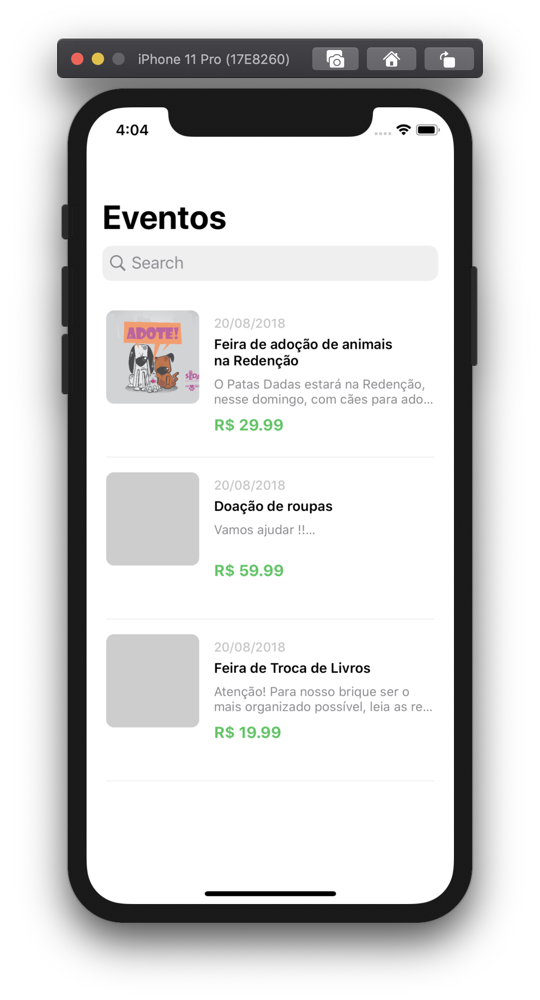
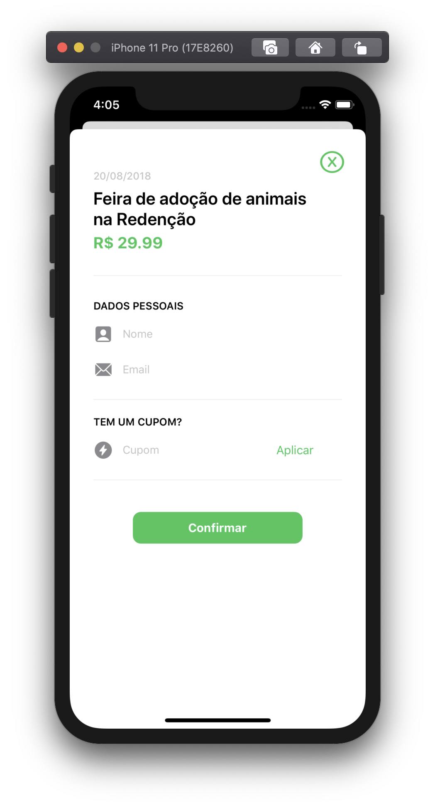

# Sigredi iOS Engineer Test
 
## Information
This is a sample app for an iOS engineer job at Sicredi - Brazil. The app features are:

* An event list
* Event details
* Event check-in with cupon option

I built it with the Model View View-Model architecture (MVVM) for it keeps the code cleaner and easier to support. I've used third-party libraries for API requests, cached image loading, and animations.

## Screenshots






## Instalation

First of all, download this repo

```
git clone https://github.com/rodrigowoulddo/Teste-Dev-iOS-Woop-Sicredi
cd Teste-Dev-iOS-Woop-Sicredi
```

Then install the third part libraries

```
pod install
```

And finally open it on XCode to launch in any device

```
xed .
```

## Extra features
* Search on the event list
* Push reload on the event list
* Smooth cell loading with animation
* Lottie animation for check-in success
* Smooth and async image loading
* Integration with Apple Maps
* Self-sizing TableViewCells